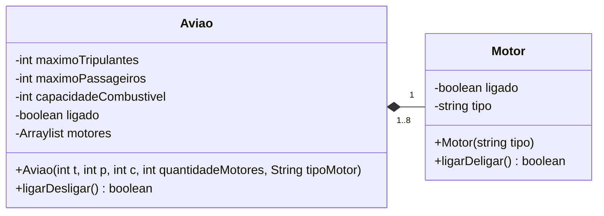

```mermaid
    classDiagram
    direction RL
    Motor "1" --* "1..8" Aviao
    
    class Aviao{
        -int maximoTripulantes
        -int maximoPassageiros
        -int capacidadeCombustivel
        -boolean ligado
        -Arraylist<Motor> motores
        +Aviao(int t, int p, int c, int quantidadeMotores, String tipoMotor )
        +ligarDesligar() boolean
    }
    
    class Motor{
        -boolean ligado
        -string tipo
        +Motor(string tipo)
        +ligarDeligar() boolean
    }
```