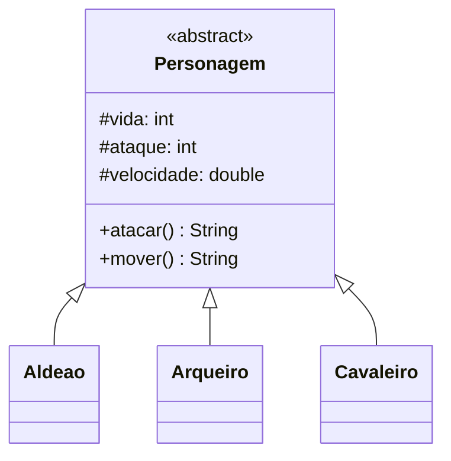

```mermaid
classDiagram
    Personagem <|-- Aldeao
    Personagem <|-- Arqueiro
    Personagem <|-- Cavaleiro
    
    class Personagem{
        <<abstract>>
        
        #vida: int
        #ataque: int
        #velocidade: double
        +atacar() String
        +mover() String
    }
    
    class Aldeao{
        
    }
    class Arqueiro{
        
    }
    class Cavaleiro{
        
    }
```