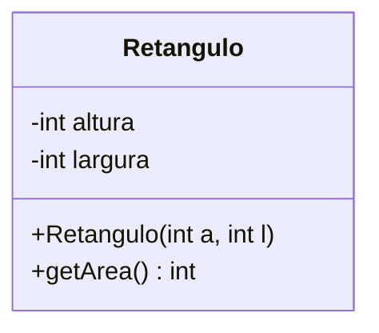
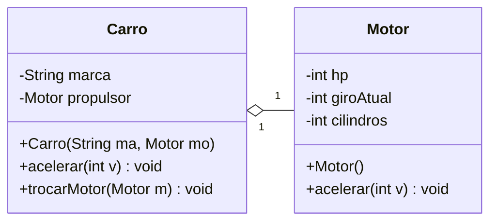

# Diagramas de classes UML

```mermaid
classDiagram
    direction LR
    
    class Retangulo{
        -int altura
        -int largura
        +Retangulo(int a, int l)
        +getArea() int
        
    }
    
``` 

```mermaid
classDiagram
    direction RL
    Motor "1" --o "1" Carro


    class Carro{
        -String marca
        -Motor propulsor
        +Carro(String ma, Motor mo)
        +acelerar(int v) void
        +trocarMotor(Motor m) void
    }
    class Motor{
        -int hp
        -int giroAtual
        -int cilindros
        +Motor()
        +acelerar(int v) void
    }
    
``` 

