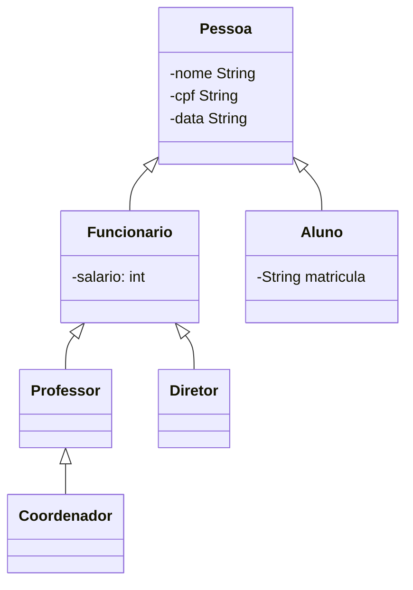
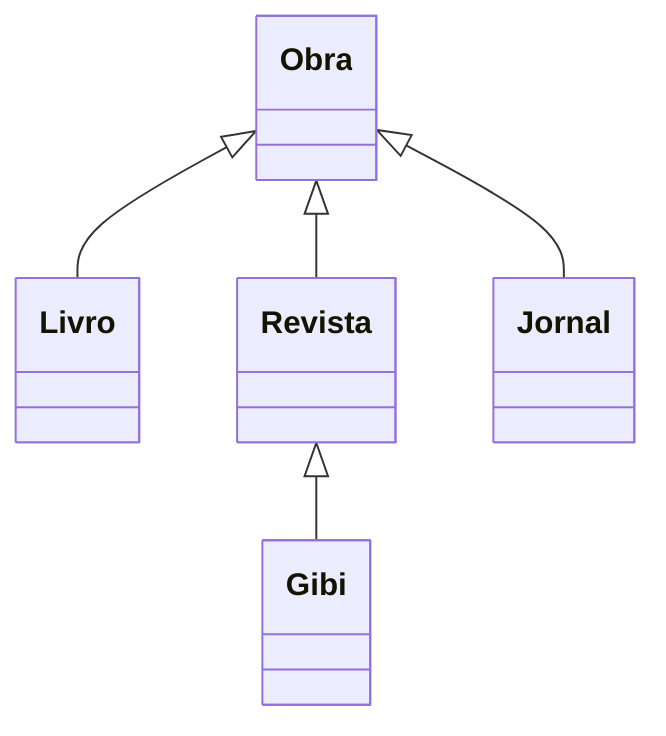

```mermaid
classDiagram
    Pessoa <|-- Funcionario
    Funcionario <|-- Professor
    Professor <|-- Coordenador
    Funcionario <|-- Diretor
    Pessoa <|-- Aluno

    class Pessoa{
        
    }
    class Funcionario{
        -salario: int
    }
 
    class Pessoa{
        -nome String 
        -cpf String 
        -data String 
    }
    
    class Aluno{
        -String matricula
    }
        
    class Professor
    class Coordenador
    class Diretor
```

```mermaid
classDiagram
    Obra <|-- Livro
    Obra <|-- Revista
    Obra <|-- Jornal
    Revista <|-- Gibi
    

    class Obra{
        
    }
    
    
```

