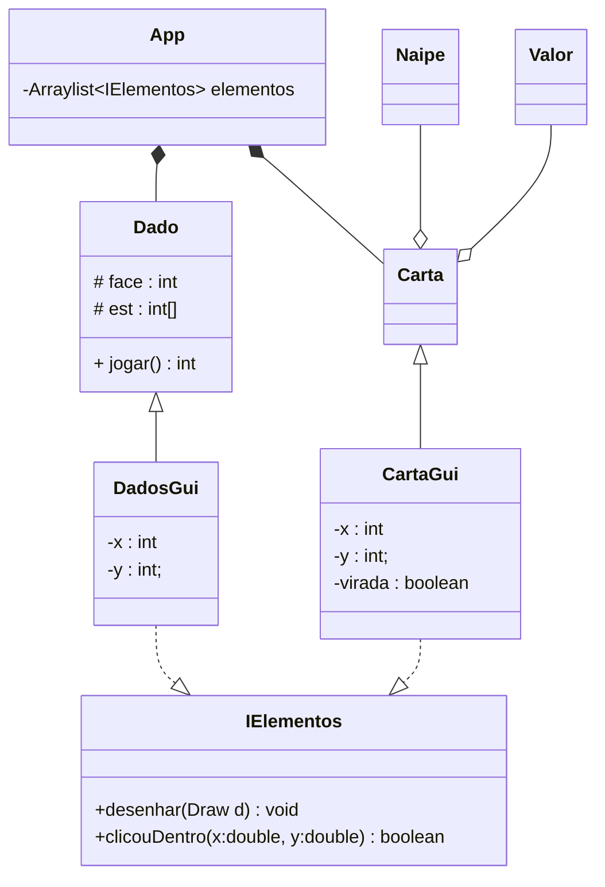

```mermaid 
classDiagram
    direction TB
    
    App *-- Carta
    App *-- Dado
    Carta <|-- CartaGui
    Naipe --o Carta
    Valor --o Carta
    Dado <|-- DadosGui
    DadosGui ..|> IElementos
    CartaGui ..|> IElementos
    
    class App{
        -Arraylist~IElementos~ elementos
    }
    
    class Dado {
        # face : int
        # est : int[]
        + jogar() int
    }
    
    class CartaGui{
        -x : int
        -y : int;
        -virada : boolean
    } 
    class DadosGui{
        -x : int
        -y : int;
    }
    class IElementos{
        +desenhar(Draw d)  void
        +clicouDentro(x:double, y:double)  boolean  
    }

```