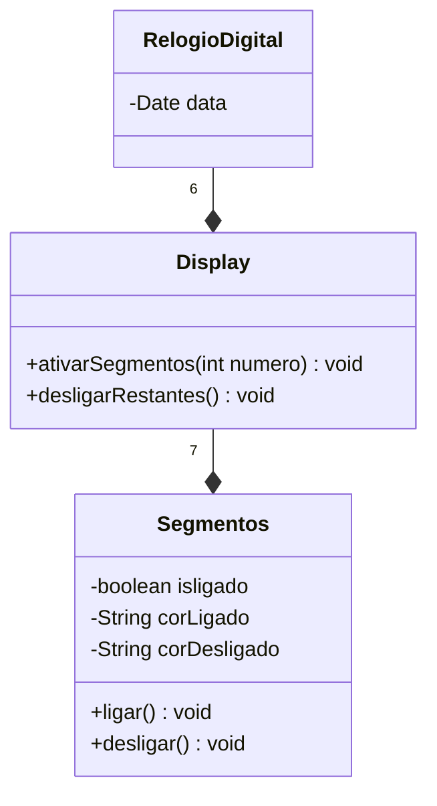

```mermaid
classDiagram
    RelogioDigital "6" --*  Display
    Display "7" --* Segmentos
    
    class RelogioDigital{
        -Date data
    }
    
    class Display{
        +ativarSegmentos(int numero) void
        +desligarRestantes() void
    }
    
    class Segmentos{
        -boolean isligado
        -String corLigado
        -String corDesligado
        +ligar() void
        +desligar() void
    }
```